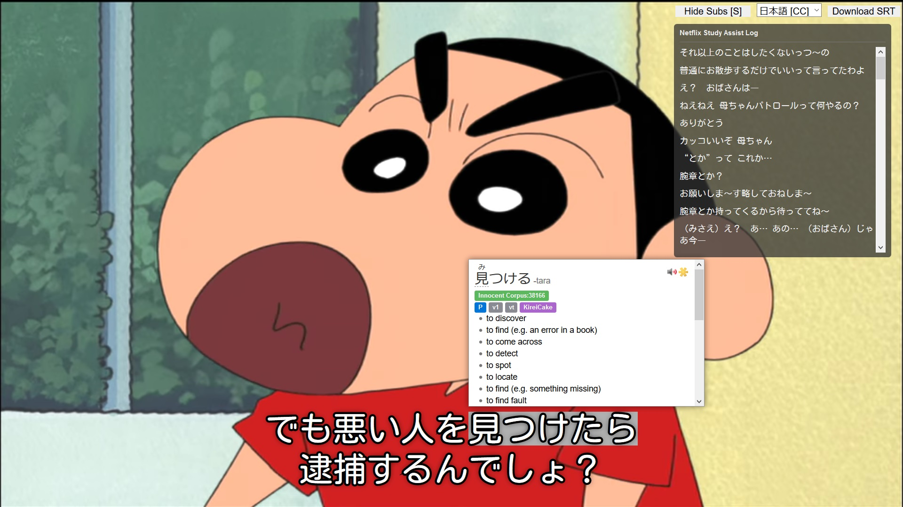

# Netflix Study Assist
Makes Netflix a little easier to study a language with (especially Japanese).

## About
Netflix uses image files for subtitles for CJK languages meaning that popup dictionaries such as Yomichan are unable to parse Netflix's subtitles. This script helps by providing the following features.

- Bring text based subtitles to the foreground (so they can be selected by a popup dictionary)
- Styles subtitles (Download [Kosugi Maru](https://fonts.google.com/specimen/Kosugi+Maru) if you want a Netflix like, rounded Japanese font)
- Logs previous subtitles, useful if you want to check on something that has just been said
- Can autopause Netflix after the current subtitle line has been spoken
- Can hide the Netflix interface
- Bind the left mouse button to pause/play
- Binds the space bar to pause/play

## Usage
Requires [subadub](https://github.com/rsimmons/subadub) and a browser plugin for running userscripts such as [Tampermonkey](https://www.tampermonkey.net).

- `Left mouse button` or `Space Bar` plays/pauses
- `Middle mouse button` or `L` shows/hides the Netflix UI
- `Right mouse button` or `I` shows/hides the log window
- `P` toggles subtitle autopause
- `R` resets the plugin (incase it has tripped up)
- `D` shows debug messages in log window

## History
This script originally required you to upload custom text based subtitle files to Netflix with Netflix's hidden `ctrl+alt+shift+t` shortcut but has since been modified to work in conjunction with [subadub](https://github.com/rsimmons/subadub). Subadub loads in the text based version of subtitles directly from Netflix so the original method is no longer needed.
